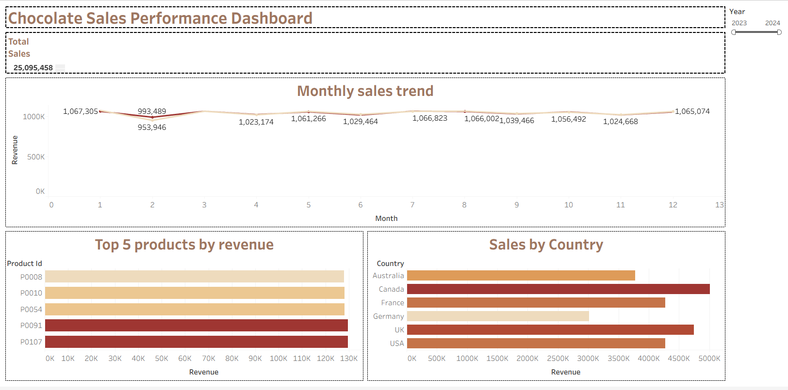

# Chocolate Sales Analysis

## Project Overview
This project analyzes chocolate sales performance using SQL and Tableau. The dashboard provides insights into monthly revenue trends, top-performing products, and country-wise sales performance.

## Tools Used
- SQL
- Tableau
- Excel

## Tableau Dashboard

This interactive Tableau dashboard helps analyze sales KPIs, revenue trends, product performance, and regional sales insights.

### Dashboard Preview

## Key Insights
- Tracked total sales performance using KPI metrics
- Identified top 5 revenue-generating products
- Compared country-wise revenue performance
- Analyzed monthly sales trends
- Built interactive year filter for dynamic analysis

## Files Included
- SQL Queries File
- Tableau Dashboard Screenshot
- Project PDF Report

## Skills Demonstrated
- SQL Querying
- Data Visualization
- Dashboard Design
- KPI Reporting
- Business Insight Analysis
